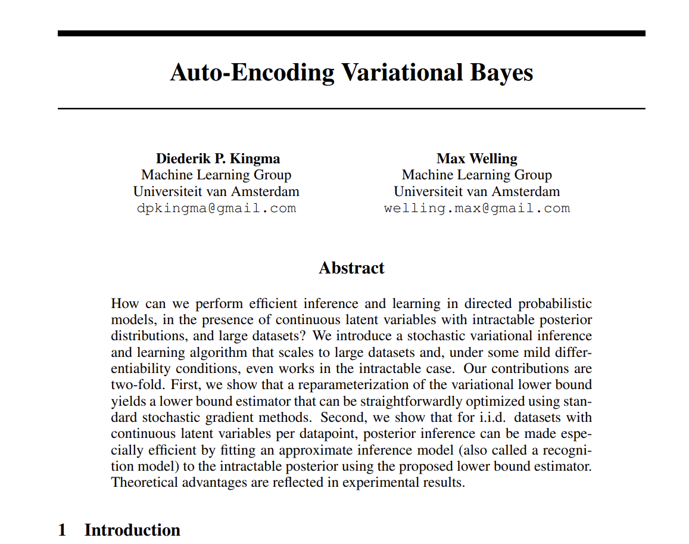
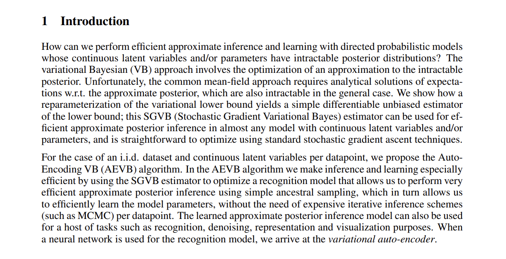
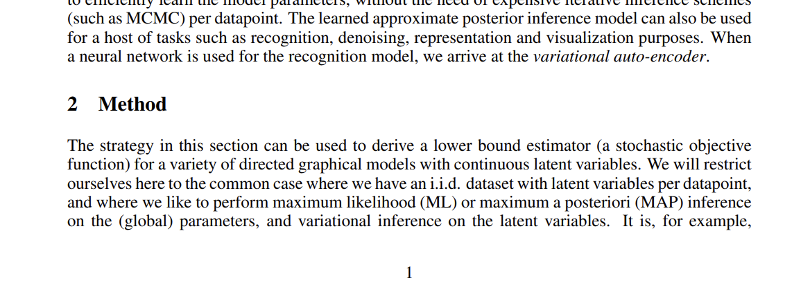
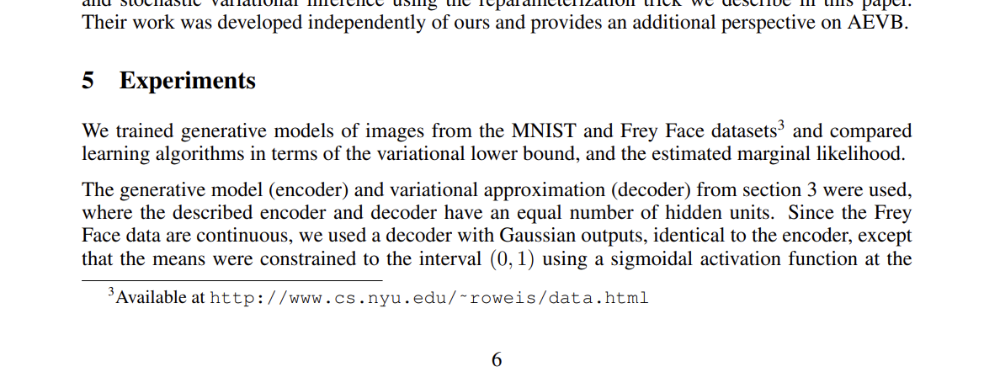
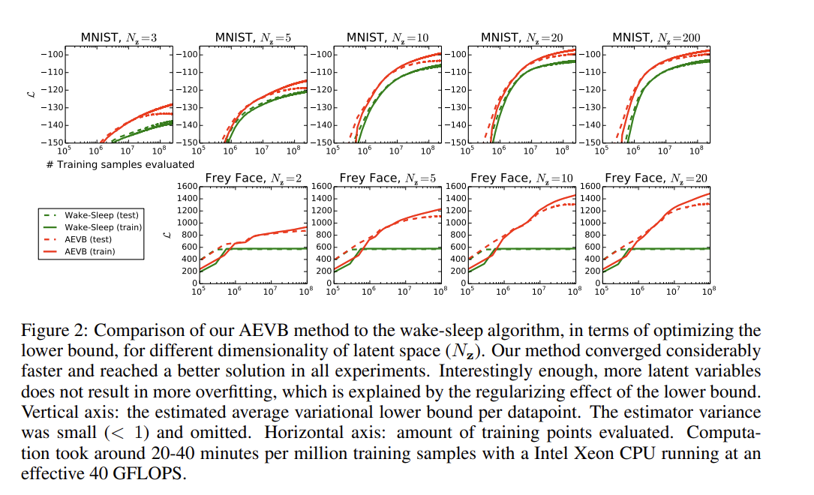
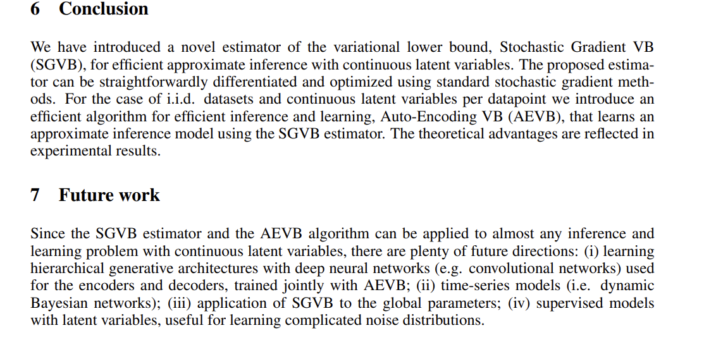

# Academic Skills in Computer Science

~~~
\author{Maxim Borisyak, Andrey Ustyuzhanin}
\institute{Constructor University Bremen}
~~~

## The Scientific Process

### What is Science?

**Science**: systematic understanding of the natural world through observation, experimentation and reasoning.

Develops theories that explain phenomena and make predictions.

### The Scientific Method

An iterative process:
1. **Observation**: notice phenomena in the world;
2. **Question**: formulate questions about what you observed;
3. **Hypothesis**: propose a testable explanation;
4. **Prediction**: derive testable predictions from the hypothesis;
5. **Experimentation**: design and conduct experiments to test predictions;
6. **Analysis**: analyze data and draw conclusions;
7. **Iteration**: refine, alter, or reject the hypothesis based on results.

### Falsifiability (Karl Popper)

A scientific hypothesis must be falsifiable:
- there must exist a possible observation that would disprove it;
- example: "All swans are white" is falsifiable
  - finding a black swan disproves it;
- non-falsifiable statements are not scientific.

### Reproducibility

Independent researchers must be able to reproduce experiments:
- results must be consistent across different settings;
- validates findings;
- fundamental to scientific method.

### Parsimony (Occam's Razor)

Prefer simpler explanations:
- simpler hypotheses over complex ones;
- simpler explanations have fewer assumptions;
- complex explanations require stronger evidence.

## Mathematics vs. Science

### Mathematics: The Language of Patterns

**Nature of Mathematics**:
- **deductive reasoning**: starts from axioms and derives theorems;
- **proof-based**: mathematical statements are proved, not tested;
- **absolute truth** (within a formal system);
- **abstract**: not necessarily tied to physical reality;
- **timeless**: mathematical truths don't change with new observations.

### Mathematical Process

Mathematical process:
1. define axioms and rules;
2. propose conjectures;
3. construct proofs or find counterexamples;
4. establish theorems.

**Example**: Pythagorean theorem ($a^2 + b^2 = c^2$) is proven from Euclidean axioms, not tested experimentally.

### Science: Understanding Nature

**Nature of Science**:
- **inductive reasoning**: generalizes from observations;
- **evidence-based**: theories supported by empirical evidence;
- **provisional truth**: theories are best current explanations;
- **empirical**: tied to observable reality;
- **evolving**: theories are refined or replaced with new evidence.

### Scientific Process

Scientific process:
1. observe phenomena;
2. formulate hypotheses;
3. test through experiments;
4. develop theories.

**Example**: Newton's laws were refined by Einstein's relativity when new evidence emerged (high velocities, strong gravity).

### Key Differences: Mathematics vs. Science

~~~
\begin{tabular}{l|p{4cm}|p{4cm}}
\textbf{Aspect} & \textbf{Mathematics} & \textbf{Science} \\ \hline
Method & Deductive (axioms $\to$ theorems) & Inductive (observations $\to$ theories) \\ \hline
Validation & Proof & Experimental evidence \\ \hline
Truth & Absolute (in formal system) & Provisional \\ \hline
Change & Theorems remain valid in their system & Theories evolve with new evidence \\ \hline
Subject & Abstract structures & Natural world \\
\end{tabular}
~~~

### The Relationship Between Math and Science

Mathematics and science are interconnected:
- **mathematics as a tool**: science uses mathematics to model phenomena;
- **science as inspiration**: physical problems inspire mathematical development;
- **applied mathematics**: develops mathematical methods for scientific problems;
- **mathematical physics**: studies mathematical structures underlying physical theories.

## Computer Science: The Science of Computation

### What is Computer Science?

The study of computation, information and algorithms.

**Not programming!** Fundamental questions:
- what can be computed? (computability);
- how efficiently? (complexity);
- what are the limits of computation?;
- how do algorithms behave?

### Theoretical Computer Science

**Mathematical foundations**:
- **computability theory**: what problems are solvable?
  - Turing machines, decidability, halting problem;
- **complexity theory**: resources needed for computation
  - P vs NP, time/space complexity classes;
- **formal verification**: proving program correctness;
- **algorithm analysis**: proving runtime and space bounds.

### Empirical Computer Science

**Scientific study of computational phenomena**:
- **algorithm behavior**: measuring performance in practice
  - average-case vs. worst-case;
  - observed performance vs. theoretical bounds;
- **systems evaluation**: measuring system performance
  - caching strategies, database indexing;
  - network protocols, distributed systems;
- **experimental algorithmics**: testing algorithmic hypotheses.

### Machine Learning as Computer Science

**Machine learning**: algorithms that learn from data.

**Theoretical aspects**:
- PAC learning theory, VC dimension;
- optimization theory (gradient descent, convex optimization);
- statistical learning theory (bias-variance tradeoff);
- information theory (entropy, mutual information).

### Machine Learning: Empirical Study

**Scientific methods in ML**:
- hypothesis: model architecture will capture patterns;
- experiment: train on data, validate on held-out set;
- analysis: measure generalization (accuracy, F1, AUC);
- iteration: refine based on empirical results.

**Open questions**:
- why do deep networks generalize?
- how much data is needed?
- what representations do models learn?

### Types of Knowledge in CS

Computer science produces different types of knowledge:
**Proven facts** (mathematical):
- sorting requires $\Omega(n \log n)$ comparisons;
- halting problem is undecidable;
- binary search is $O(\log n)$.

**Empirical findings** (scientific):
- hash tables perform well in practice;
- neural networks learn hierarchical features;
- cache locality affects performance.

### Research Methods in Computer Science

CS research methods:
1. **mathematical/theoretical**: proving theorems
   - complexity lower bounds, correctness proofs;
2. **experimental**: measuring algorithmic performance
   - benchmark datasets, performance evaluation;
3. **empirical**: studying computational phenomena
   - user studies, large-scale data analysis;
4. **simulation**: modeling system behavior.

## Structure of Scientific Papers

### Scientific Papers (Empirical Sciences)

Standard structure (IMRaD):
1. **introduction**: motivate the problem, state research question;
2. **methods**: describe experimental setup and procedures;
3. **results**: present data and observations;
4. **discussion**: interpret results, compare with prior work;
5. **conclusion**: summarize findings and implications.

### Scientific Papers: Key Characteristics

**Empirical focus**:
- report experimental data;
- describe methodology in detail (reproducibility);
- statistical analysis of results;
- figures and tables with data.

**Citation style**:
- cite prior experimental work;
- compare results with literature;
- discuss discrepancies.

### Mathematical Papers

Standard structure:
1. **introduction**: motivate the problem, state main theorems;
2. **preliminaries**: definitions, notation, known results;
3. **main results**: theorems with proofs;
4. **corollaries and applications**: consequences of main results;
5. **conclusion**: summarize contributions, open problems.

### Mathematical Papers: Key Characteristics

**Proof-based**:
- every claim must be proven;
- rigorous logical structure;
- definitions must be precise;
- no experimental data.

**Theorem-proof format**:
- state theorem formally;
- provide complete proof;
- lemmas support main theorems.

### Computer Science Papers: Theoretical

Similar to mathematical papers:
1. **introduction**: problem, main results;
2. **preliminaries**: definitions, model, prior results;
3. **main results**: theorems and proofs;
4. **conclusion**: contributions, open problems.

**Examples**: complexity lower bounds, algorithm correctness proofs, impossibility results.

### Computer Science Papers: Empirical

Similar to scientific papers:
1. **introduction**: problem, research questions;
2. **related work**: prior approaches;
3. **method/system**: algorithm or system description;
4. **experimental setup**: datasets, baselines, metrics;
5. **results**: performance measurements, analysis;
6. **conclusion**: findings, future work.

**Examples**: ML papers, systems papers, performance studies.

### Computer Science Papers: Hybrid

Combine both approaches:
1. **introduction**: problem, contributions;
2. **related work**: theoretical and empirical background;
3. **theoretical analysis**: algorithm with proofs;
4. **experimental evaluation**: empirical validation;
5. **conclusion**: theoretical and empirical contributions.

**Example**: new algorithm with proven bounds AND experimental comparison to existing methods.

### Example: Auto-Encoding Variational Bayes

### Example: Auto-Encoding Variational Bayes

### Example: Auto-Encoding Variational Bayes

### Example: Auto-Encoding Variational Bayes

### Example: Auto-Encoding Variational Bayes

### Example: Auto-Encoding Variational Bayes

### Paper Structure Reflects Methodology

Paper structure follows the discipline's methodology.

**Science papers** follow the scientific method:
- introduction: research question, hypothesis;
- methods: how to test the hypothesis;
- results: data from experiments;
- discussion: interpret results, compare to hypothesis;
- mirrors: hypothesis → experiment → analyze → conclude.

### Paper Structure Reflects Methodology

**Mathematics papers** follow deductive reasoning:
- introduction: state theorems to be proven;
- preliminaries: axioms, definitions, prior results;
- main results: prove theorems from axioms;
- conclusion: what was proven, open problems;
- mirrors: axioms → conjecture → proof → theorem.

### Paper Structure Reflects Methodology

**CS papers** follow their methodology:
- theoretical: like mathematics (axioms → proof);
- empirical: like science (hypothesis → experiment);
- hybrid: both approaches in one paper;
- structure matches the type of claims being made.

### Peer Review Process

Papers are evaluated before publication:
- authors submit manuscript to journal or conference;
- editor sends to multiple expert reviewers;
- reviewers evaluate correctness, novelty, significance;
- accept, reject, or request revisions;
- iterative process until acceptance or rejection.

### Peer Review: Purpose

Why peer review:
- finds errors in proofs or experiments;
- evaluates significance of contributions;
- ensures paper meets publication standards;
- improves quality through reviewer feedback;
- science is self-correcting.

## Conclusion

### Summary

Different disciplines, different methods:
- **science**: inductive reasoning, experiments, provisional truth;
- **mathematics**: deductive reasoning, proofs, absolute truth;
- **computer science**: combines both approaches.

Paper structure reflects methodology.

Understand the methodology to succeed in research.