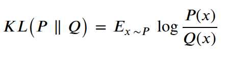

# Introduction to \LaTeX

~~~
\author{Maxim Borisyak, Andrey Ustyuzhanin}
\institute{Constructor University Bremen}
\usepackage{amsmath}
\usepackage{booktabs}
\usepackage{ifthen}
\usepackage{pgffor}

\DeclareMathOperator*{\E}{\mathbb{E}}
\DeclareMathOperator*{\argmin}{arg\,min}

\newcommand{\R}{\mathbb{R}}
\newcommand{\N}{\mathbb{N}}
\newcommand{\norm}[2][L^2]{%
\left\| #2 \right\|_{#1}%
}
\newcommand{\inner}[2]{\left\langle #1, #2 \right\rangle}
\newcommand{\loss}{\mathcal{L}}
\newcommand{\model}{f_\theta}
\newcommand{\dataset}{\mathcal{D}}

\newenvironment{important}{%
  \begin{center}\begin{minipage}{0.9\textwidth}\textbf{Important:} \itshape
}{%
  \end{minipage}\end{center}
}

\newenvironment{method}[1]{%
  \begin{block}{Method: #1}
}{%
  \end{block}
}

\newcommand{\grade}[1]{%
  \ifthenelse{#1 > 89}{A}{%
  \ifthenelse{#1 > 79}{B}{%
  \ifthenelse{#1 > 69}{C}{F}}}%
}

~~~

## What is \LaTeX?

### \LaTeX

- A professional typesetting system for technical documents
- Widely used in Computer Science, Mathematics, Physics
- Ideal for documents with formulas, algorithms, references
- Not a word processor — you write source code that compiles into PDF

### \LaTeX\ vs. Word Processors

Word:


---

Beamer (\LaTeX\;slides):
~~~align*
\mathrm{KL}\left(P\;\middle\|\;Q\right) = \E_{x \sim P} \log \frac{P(x)}{Q(x)}
~~~

Proper \LaTeX:


### Why \LaTeX?

**For academic writing**:
- required by most CS conferences and journals;
- consistent, professional formatting;
- automatic numbering (sections, figures, equations, references);
- excellent math typesetting;
- reproducible builds from source.

**In practice**:
- Overleaf: collaborative online \LaTeX\ editor;
- local editors: TeXstudio, VS Code + LaTeX Workshop.

### Workflow

1. Write `\texttt{.tex}` source file;
2. Compile with `\texttt{pdflatex}` (or `\texttt{xelatex}`, `\texttt{lualatex}`);
3. Run `\texttt{bibtex}`/`\texttt{biber}` for references;
4. Recompile (twice) to resolve cross-references;
5. Get PDF output.

Most editors handle this automatically.

## Document Structure

### Minimal Document

A minimal \LaTeX\ document:

```latex
\documentclass{article}

\begin{document}
Hello, World!
\end{document}
```

- `\texttt{\textbackslash documentclass\{...\}}` — type of document (`\texttt{article}`, `\texttt{report}`, `\texttt{book}`, `\texttt{beamer}`);
- `\texttt{\textbackslash begin\{document\}...\textbackslash end\{document\}}` — the document body.

### Preamble

~~~
\footnotesize
~~~

Everything between `\texttt{\textbackslash documentclass}` and `\texttt{\textbackslash begin\{document\}}` is the **preamble**:

~~~
\begin{minted}[fontsize=\footnotesize]{latex}
\documentclass[12pt, a4paper]{article}

\usepackage[utf8]{inputenc}
\usepackage{amsmath}
\usepackage{graphicx}
\usepackage{hyperref}

\title{My First Paper}
\author{Jane Doe}
\date{\today}

\begin{document}
\maketitle
...
\end{document}
\end{minted}
~~~

### Common Document Classes

- `\texttt{article}` — short documents, papers;
- `\texttt{report}` — longer documents with chapters;
- `\texttt{book}` — books, theses;
- `\texttt{beamer}` — presentations (slides);
- many conferences provide their own class (e.g., `\texttt{llncs}`, `\texttt{acmart}`).

### Packages

Packages extend \LaTeX\ functionality:

```latex
\usepackage{amsmath}      % advanced math
\usepackage{graphicx}     % include images
\usepackage{hyperref}     % clickable links
\usepackage{booktabs}     % professional tables
\usepackage{algorithm2e}  % algorithm pseudocode
\usepackage{listings}     % source code
\usepackage{tikz}         % diagrams
```

Load packages in the preamble with `\texttt{\textbackslash usepackage[options]\{name\}}`.

### Sectioning

\LaTeX\ provides hierarchical sections:

```latex
\section{Introduction}
\subsection{Background}
\subsubsection{Details}
\paragraph{Note}
```

- Sections are automatically numbered;
- `\texttt{\textbackslash section*\{...\}}` — unnumbered version;
- `\texttt{\textbackslash tableofcontents}` — generates table of contents automatically.

## Text Formatting

### Basic Text Formatting

```latex
\textbf{bold text}
\textit{italic text}
\texttt{monospace text}
\underline{underlined text}

\emph{emphasized} % italic in normal text,
                   % normal in italic context
```

**Result**: **bold text**, *italic text*, `\texttt{monospace text}`

### Lists

**Itemized (bullet) list**:
```latex
\begin{itemize}
  \item First item
  \item Second item
\end{itemize}
```

**Enumerated (numbered) list**:
```latex
\begin{enumerate}
  \item First item
  \item Second item
\end{enumerate}
```

Lists can be nested.

### Special Characters

Some characters have special meaning in \LaTeX:

```latex
\%  \$  \&  \#  \_  \{  \}
\textbackslash  \textasciitilde
```

- `\texttt{\%}` — comment (rest of line is ignored);
- `\texttt{\$}` — math mode delimiter;
- `\texttt{\&}` — column separator in tables;
- `\texttt{\textbackslash\textbackslash}` — line break;
- `\texttt{\textasciitilde}` — non-breaking space.

### Whitespace and Line Breaks

- Multiple spaces are treated as one space;
- an empty line starts a new paragraph;
- `\texttt{\textbackslash\textbackslash}` forces a line break;
- `\texttt{\textbackslash newpage}` starts a new page;
- `\texttt{\textbackslash noindent}` suppresses paragraph indentation.

```latex
First paragraph text.

Second paragraph text.

\noindent Third paragraph, no indent.
```

## Mathematics

### Inline and Display Math

**Inline math** — within text:
```latex
The equation $E = mc^2$ is famous.
```
The equation $E = mc^2$ is famous.

**Display math** — centered on its own line:
```latex
\[ E = mc^2 \]
```
\[ E = mc^2 \]

### Numbered equation

**Numbered equation**:
```latex
\begin{equation}
  E = mc^2
  \label{eq:einstein}
\end{equation}

The equation~\eqref{eq:einstein} is famous.
```
- - -

\begin{equation}
  E = mc^2
  \label{eq:einstein}
\end{equation}
The equation~\eqref{eq:einstein} is famous.


### Basic Math Notation

```latex
x^2          % superscript
x_i          % subscript
x_{i+1}^{2} % grouped sub/superscript
\frac{a}{b}  % fraction
\sqrt{x}     % square root
\sqrt[3]{x}  % cube root
```

~~~
$$x^2 \qquad x_i \qquad x_{i+1}^{2} \qquad \frac{a}{b} \qquad \sqrt{x} \qquad \sqrt[3]{x}$$
~~~

### Greek Letters and Symbols

```latex
\alpha \beta \gamma \delta \epsilon
\theta \lambda \mu \sigma \omega
\Gamma \Delta \Theta \Lambda \Omega
\infty \partial \nabla \forall \exists
\in \notin \subset \cup \cap
\leq \geq \neq \approx \equiv
```

~~~
$$\alpha \ \beta \ \gamma \ \delta \ \epsilon \qquad \theta \ \lambda \ \mu \ \sigma \ \omega$$
$$\Gamma \ \Delta \ \Theta \ \Lambda \ \Omega \qquad \infty \ \partial \ \nabla \ \forall \ \exists$$
~~~

### Sums, Products, Integrals

```latex
\sum_{i=1}^{n} x_i

\prod_{i=1}^{n} x_i

\int_{a}^{b} f(x) \, dx

\lim_{n \to \infty} a_n
```

~~~
$$\sum_{i=1}^{n} x_i \qquad \prod_{i=1}^{n} x_i \qquad \int_{a}^{b} f(x) \, dx \qquad \lim_{n \to \infty} a_n$$
~~~

### Matrices

~~~
\footnotesize
~~~

```latex
\begin{pmatrix}
  a & b \\
  c & d
\end{pmatrix}

\begin{bmatrix}
  1 & 0 \\
  0 & 1
\end{bmatrix}
```

~~~
$$\begin{pmatrix} a & b \\ c & d \end{pmatrix} \qquad \begin{bmatrix} 1 & 0 \\ 0 & 1 \end{bmatrix} \qquad \begin{vmatrix} 1 & 0 \\ 0 & 1 \end{vmatrix}$$
~~~

- `\texttt{pmatrix}` — round brackets;
- `\texttt{bmatrix}` — square brackets;
- `\texttt{vmatrix}` — determinant (vertical bars).

### Aligned Equations

The `\texttt{align}` environment (from `\texttt{amsmath}`):

```latex
\begin{align}
  f(x) &= x^2 + 2x + 1 \\
       &= (x + 1)^2
\end{align}
```

- `\texttt{\&}` marks alignment point;
- `\texttt{\textbackslash\textbackslash}` separates lines;
- `\texttt{align*}` for unnumbered version.

~~~align
  f(x) &= x^2 + 2x + 1 \\
       &= (x + 1)^2
~~~

### Common Math Environments

- `\texttt{equation}` — single numbered equation;
- `\texttt{align}` — multiple aligned equations;
- `\texttt{gather}` — multiple centered equations;
- `\texttt{cases}` — piecewise definitions:

- - -

```latex
f(x) = \begin{cases}
  1  & \text{if } x > 0 \\
  0  & \text{if } x = 0 \\
  -1 & \text{if } x < 0
\end{cases}
```

***[T]

~~~align
f(x) = \begin{cases}
  1  & \text{if } x > 0 \\
  0  & \text{if } x = 0 \\
  -1 & \text{if } x < 0
\end{cases}
~~~

### Example: Machine Learning

A practical example — softmax function:

~~~
{
\footnotesize
\begin{minted}{latex}
\mathrm{softmax}(z_i) = \frac{e^{z_i}}{\sum_{j=1}^{K} e^{z_j}}
\end{minted}
}
~~~

Cross-entropy loss:

```latex
\mathcal{L} = -\sum_{i=1}^{N} \sum_{c=1}^{C}
              y_{i,c} \log(\hat{y}_{i,c})
```

~~~
$$\mathrm{softmax}(z_i) = \frac{e^{z_i}}{\sum_{j=1}^{K} e^{z_j}} \qquad \mathcal{L} = -\sum_{i=1}^{N} \sum_{c=1}^{C} y_{i,c} \log(\hat{y}_{i,c})$$
~~~

## Floats: Figures and Tables

### Including Figures

~~~
{
\footnotesize
\begin{minted}{latex}
\begin{figure}[htbp]
  \centering
  \includegraphics[width=0.8\textwidth]{image.png}
  \caption{Description of the figure.}
  \label{fig:example}
\end{figure}
\end{minted}
}
~~~

- `\texttt{[htbp]}` — placement hints: here, top, bottom, page;
- `\texttt{\textbackslash centering}` — center the figure;
- `\texttt{\textbackslash caption}` — figure caption (auto-numbered);
- `\texttt{\textbackslash label}` — for cross-referencing.


### Tables: example

~~~
{
\footnotesize
\begin{minted}{latex}
\begin{table}[htbp]
  \centering
  \caption{Comparison of optimization methods.}
  \label{tab:optimizers}
  \begin{tabular}{lccc}
    \toprule
    Optimizer & Learning Rate & Epochs & Test Acc. \\
    \midrule
    SGD       & 0.01          & 100    & 0.88 \\
    Adam      & 0.001         & 50     & 0.91 \\
    AdamW     & 0.001         & 50     & \textbf{0.93} \\
    \bottomrule
  \end{tabular}
\end{table}
\end{minted}
}
~~~

Use `\texttt{booktabs}` package for `\texttt{\textbackslash toprule}`, `\texttt{\textbackslash midrule}`, `\texttt{\textbackslash bottomrule}`.

### Tables: example

~~~
\begin{table}[htbp]
  \centering
  \caption{Comparison of optimization methods.}
  \label{tab:optimizers}
  \begin{tabular}{lccc}
    \toprule
    Optimizer & Learning Rate & Epochs & Test Acc. \\
    \midrule
    SGD       & 0.01          & 100    & 0.88 \\
    Adam      & 0.001         & 50     & 0.91 \\
    AdamW     & 0.001         & 50     & \textbf{0.93} \\
    \bottomrule
  \end{tabular}
\end{table}
~~~

### Table Column Types

Column alignment specifiers in `\texttt{\textbackslash begin\{tabular\}\{...\}}`:

- `\texttt{l}` — left-aligned;
- `\texttt{c}` — centered;
- `\texttt{r}` — right-aligned;
- `\texttt{p\{width\}}` — paragraph column with fixed width;
- `\texttt{|}` — vertical line (avoid in professional tables).

- - -

~~~
{
\footnotesize
\begin{minted}{latex}
\begin{tabular}{l|cc|r}
  Name & Score 1 & Score 2 & Total \\
  \hline
  Alice & 95 & 88 & 183 \\
\end{tabular}
\end{minted}
}
~~~

### Table Column Types

~~~
{
\footnotesize
\begin{minted}{latex}
\begin{tabular}{l|cc|r}
  Name & Score 1 & Score 2 & Total \\
  \hline
  Alice & 95 & 88 & 183 \\
\end{tabular}
\end{minted}
}
~~~

- - -

~~~
\begin{tabular}{l|cc|r}
  Name & Score 1 & Score 2 & Total \\
  \hline
  Alice & 95 & 88 & 183 \\
\end{tabular}
~~~

## Cross-references and Citations

### Labels and References

\LaTeX\ can reference any numbered element:

```latex
\section{Introduction}
\label{sec:intro}

As shown in Figure~\ref{fig:arch}
and Equation~\eqref{eq:loss}
(see Section~\ref{sec:intro}).
```

- `\texttt{\textbackslash label\{...\}}` — place after `\texttt{\textbackslash caption}`, `\texttt{\textbackslash section}`, or in an equation;
- `\texttt{\textbackslash ref\{...\}}` — produces the number;
- `\texttt{\textbackslash eqref\{...\}}` — equation reference with parentheses;
- `\texttt{\textasciitilde}` — non-breaking space before the reference.

### Bibliography with BibTeX

Create a `\texttt{.bib}` file:

```bibtex
@article{vaswani2017attention,
  title={Attention is all you need},
  author={Vaswani, Ashish and others},
  journal={NeurIPS},
  year={2017}
}
```

In the document:
```latex
Transformers~\cite{vaswani2017attention}
have revolutionized NLP.

\bibliographystyle{plain}
\bibliography{references}
```

### Citation Commands

Basic commands:
- `\texttt{\textbackslash cite\{key\}}` — `\texttt{[1]}` or (Author, Year);
- `\texttt{\textbackslash cite\{key1, key2\}}` — multiple citations.

With `\texttt{natbib}` package:
- `\texttt{\textbackslash citet\{key\}}` — textual: Author (Year);
- `\texttt{\textbackslash citep\{key\}}` — parenthetical: (Author, Year);
- `\texttt{\textbackslash citep[see][]\{key\}}` — (see Author, Year).

### Compilation with References

To resolve all references:

```bash
pdflatex document
bibtex document
pdflatex document
pdflatex document
```

Multiple passes needed because:
1. first pass collects labels and citations;
2. `\texttt{bibtex}` generates bibliography;
3. second pass inserts references;
4. third pass resolves page numbers.

## Useful Environments and Tips

### Code Listings

Using the `\texttt{listings}` package:

```latex
\begin{lstlisting}[language=Python]
def hello():
    print("Hello, World!")
\end{lstlisting}
```

Or the `\texttt{minted}` package (requires Python's Pygments):

~~~
\begin{verbatim}
\begin{minted}{python}
def hello():
    print("Hello, World!")
\end{minted}
\end{verbatim}
~~~

### Theorem-like Environments

Define in the preamble:
```latex
\newtheorem{theorem}{Theorem}
\newtheorem{lemma}{Lemma}
\newtheorem{definition}{Definition}
```

Use in the document:
```latex
\begin{theorem}
  For all $n \geq 1$:
  $\sum_{i=1}^n i = \frac{n(n+1)}{2}$.
\end{theorem}
\begin{proof}
  By induction on $n$...
\end{proof}
```

### Theorem-like Environments

~~~
\begin{theorem}
  For all $n \geq 1$:
  $\sum_{i=1}^n i = \frac{n(n+1)}{2}$.
\end{theorem}
\begin{proof}
  By induction on $n$...
\end{proof}
~~~

### Common Mistakes

**Avoid these pitfalls**:
- forgetting `\texttt{\{\}}` for multi-character sub/superscripts: `\texttt{x\^{}10}` vs. `\texttt{x\^{}\{10\}}`:
  - $x^10$ vs. $x^{10}$
- using `\texttt{"}` instead of `\texttt{``}` and `\texttt{''}` for quotes;
- not escaping special characters: `\texttt{50\%}` should be `\texttt{50\textbackslash\%}`;
- placing `\texttt{\textbackslash label}` before `\texttt{\textbackslash caption}` (label will be wrong);
- ignoring warnings about undefined references.

### Useful Commands to Know

```latex
\phantom{text}       % invisible space
\vspace{1cm}         % vertical space
\hspace{1cm}         % horizontal space
\textcolor{red}{txt} % colored text (xcolor)
\url{https://...}    % typeset URL (hyperref)
\footnote{text}      % footnote
\todo{Fix this}      % margin note (todonotes)
```

## \LaTeX\ Programming

### Custom Commands: `\texttt{\textbackslash newcommand}`

Define reusable shorthands — especially useful for math notation:

```latex
\newcommand{\R}{\mathbb{R}}
\newcommand{\N}{\mathbb{N}}
\newcommand{\norm}[1]{\left\| #1 \right\|}
\newcommand{\inner}[2]{\left\langle #1, #2 \right\rangle}
```

Usage:
```latex
Let $f : \R^n \to \R$ and $x \in \R^n$.
Then $\norm{x} = \sqrt{\inner{x}{x}}$.
```

~~~
Let $f : \R^n \to \R$ and $x \in \R^n$.
Then $\norm{x} = \sqrt{\inner{x}{x}}$.
~~~

Define once in the preamble, use everywhere — change notation globally by editing one line.

### Custom Commands: optional arguments

`\texttt{\textbackslash newcommand}` supports optional arguments with defaults:

```latex
% [1] = 1 argument, [L^2] = default value
\newcommand{\norm}[2][L^2]{%
  \left\| #2 \right\|_{#1}%
}
```

```latex
$\norm{f}$            => \left\|f\right\|_{L^2}
$\norm[L^\infty]{f}$  => \left\|f\right\|_{L^\infty}
```

~~~center
$\norm{f}$ \qquad $\norm[L^\infty]{f}$
~~~

- - -

- `\texttt{\#1}` — first argument (optional, with default);
- `\texttt{\#2}` — second argument (mandatory);
- `\texttt{\%}` at end of line — suppress unwanted whitespace.

### `\texttt{\textbackslash renewcommand}`

Override existing commands:

```latex
% Change equation numbering to include section
\renewcommand{\theequation}{%
  \thesection.\arabic{equation}%
}

% Redefine abstract name
\renewcommand{\abstractname}{Executive Summary}
```

- Use `\texttt{\textbackslash renewcommand}` for commands that already exist;
- use `\texttt{\textbackslash newcommand}` for new commands — it errors if the command already exists (safety check).

### Custom Environments

`\texttt{\textbackslash newenvironment\{name\}[args]\{begin-code\}\{end-code\}}`:

```latex
\newenvironment{important}{%
  \begin{center}
  \begin{minipage}{0.9\textwidth}
  \textbf{Important:} \itshape
}{%
  \end{minipage}
  \end{center}
}
```

### Custom Environments

Usage:
```latex
\begin{important}
  Always compile twice to resolve references.
\end{important}
```

- - -

Result:
~~~
\begin{important}
  Always compile twice to resolve references.
\end{important}
~~~

### Custom Environments with Arguments

Environments can also accept arguments:

```latex
\newenvironment{method}[1]{%
  \begin{block}{Method: #1}
}{%
  \end{block}
}
```

### Custom Environments with Arguments

```latex
\begin{method}{Gradient Descent}
  Update rule: $\theta \leftarrow \theta
    - \alpha \nabla_\theta \mathcal{L}$
\end{method}
```

- - -

~~~
\begin{method}{Gradient Descent}
  Update rule: $\theta \leftarrow \theta - \alpha \nabla_\theta \loss$
\end{method}
~~~

Combine with `\texttt{\textbackslash newcommand}` to build a consistent notation system for your paper or thesis.

### Counters

\LaTeX\ uses counters for automatic numbering:

```latex
\newcounter{example}[section]  % reset per section

\newcommand{\example}{%
  \stepcounter{example}%
  \textbf{Example~\thesection.\theexample}%
}
```

Useful counter commands:
- `\texttt{\textbackslash newcounter\{name\}[parent]}` — create a counter;
- `\texttt{\textbackslash setcounter\{name\}\{value\}}` — set value;
- `\texttt{\textbackslash stepcounter\{name\}}` — increment by 1;
- `\texttt{\textbackslash arabic\{name\}}`, `\texttt{\textbackslash roman\{name\}}` — display formats.

### Lengths

Control spacing and sizes with length registers:

```latex
\newlength{\mywidth}
\setlength{\mywidth}{0.45\textwidth}
\addtolength{\mywidth}{-1cm}
```

- `\texttt{\textbackslash newlength}` — define a length register;
- `\texttt{\textbackslash setlength}` — assign a value;
- `\texttt{\textbackslash addtolength}` — add to current value;
- units: `\texttt{pt}`, `\texttt{cm}`, `\texttt{em}`, `\texttt{ex}`, or relative like `\texttt{0.5\textbackslash textwidth}`.

### Conditionals

The `\texttt{ifthen}` package provides readable conditionals:

```latex
\usepackage{ifthen}

\newcommand{\grade}[1]{%
  \ifthenelse{#1 > 89}{A}{%
  \ifthenelse{#1 > 79}{B}{%
  \ifthenelse{#1 > 69}{C}{F}}}%
}
```

- - - 

```latex
Score 95: \grade{95}
Score 72: \grade{72}
```
***
~~~
Score 95: \grade{95} \\ Score 72: \grade{72}
~~~

- - -

Also available: `\texttt{\textbackslash ifdefined}`, `\texttt{\textbackslash ifx}` (low-level \TeX\ conditionals) and the `\texttt{etoolbox}` package for modern alternatives.

### Loops with `\texttt{pgffor}`

The `\texttt{pgffor}` package (part of TikZ/PGF) provides `\texttt{\textbackslash foreach}`:

~~~
{
\footnotesize
\begin{minted}{latex}
\usepackage{pgffor}

\foreach \x in {1,2,...,5} {
  Item \x;\,
}

\foreach \name/\score in {
  Alice/95, Bob/87, Carol/91} {
  \name: \score\\
}
\end{minted}
}
~~~

~~~
\foreach \x in {1,2,...,5} {Item \x;\,}
~~~

Useful for generating repetitive content: tables, TikZ diagrams, lists.

### Practical Example: Paper Preamble

~~~
\footnotesize
~~~

A real-world preamble with custom commands:

~~~
{
\footnotesize
\begin{minted}{latex}
% Number sets
\newcommand{\R}{\mathbb{R}}
% Operators
\DeclareMathOperator*{\E}{\mathbb{E}}
\DeclareMathOperator*{\argmin}{arg\,min}
\DeclareMathOperator{\KL}{KL}
% Shortcuts
\newcommand{\loss}{\mathcal{L}}
\newcommand{\model}{f_\theta}
\newcommand{\dataset}{\mathcal{D}}
% Norms and brackets
\newcommand{\norm}[1]{\left\| #1 \right\|}
\newcommand{\abs}[1]{\left| #1 \right|}
\end{minted}
}
~~~

### Practical Example: Usage

With the preamble above, you write concise math:

~~~
{
\footnotesize
\begin{minted}{latex}
\begin{align*}
  \loss(\theta) &= \E_{(x,y) \sim \dataset}
                     \norm{\model(x) - y}^2;\\
  \theta^* &= \argmin_\theta \loss(\theta).
\end{align*}
\end{minted}
}
~~~

~~~
\begin{align*}
  \loss(\theta) &= \E_{(x,y) \sim \dataset} \norm{\model(x) - y}^2;\\
  \theta^* &= \argmin_\theta \loss(\theta).
\end{align*}
~~~

Readable source, beautiful output — and easy to change notation globally.

## Conclusion

### Summary

\LaTeX\ is essential for academic CS writing:
- **document structure**: `\texttt{\textbackslash documentclass}`, preamble, environments;
- **math typesetting**: inline `\texttt{\$...\$}`, display `\texttt{\textbackslash[...\textbackslash]}`, `\texttt{align}`;
- **floats**: `\texttt{figure}`, `\texttt{table}` with `\texttt{\textbackslash caption}` and `\texttt{\textbackslash label}`;
- **references**: `\texttt{\textbackslash label}`/`\texttt{\textbackslash ref}`, BibTeX for citations;
- **packages**: extend functionality as needed.